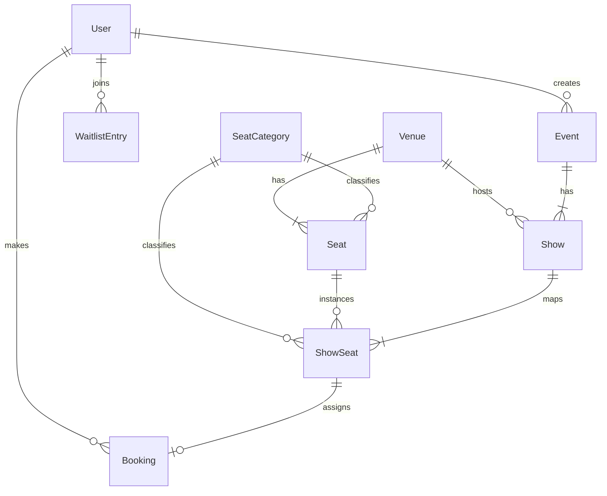

# TicketSphere — High-Concurrency Ticket Booking System

A production-ready, full-stack event & movie ticket booking platform built with **Python (Django REST Framework & ASGI Channels)** for the backend API and **React 19 + TypeScript + Vite** for the dynamic web frontend.

---

## 🔗 Live Deployment

- **Frontend**: https://ticket-sphere-dusky.vercel.app/
- **Backend API**: https://ticketsphere-api-ypje.onrender.com/api/

**Demo Login Credentials:**
- **Customer**: `customer` / `customer1234`
- **Organiser**: `organizer` / `12345678`
- **Admin**: `admin` / `admin1234`

---

## 🛠️ Technology Stack

| Layer | Technology | Purpose |
|---|---|---|
| **Backend API** | **Python 3.9+ (Django 4.2 & DRF)** | REST API, role-based JWT auth, seat-hold TTL engine, waitlist queue |
| **Real-Time WebSockets** | **Django Channels (Daphne / ASGI)** | Real-time seat map updates & live hold/booking broadcasting |
| **Frontend Web App** | **React 19, TypeScript, Vite** | Single-page application with responsive interactive seat map grid |
| **Styling & Icons** | **Tailwind CSS & Lucide Icons** | Custom glassmorphism dark theme with cursor ambient spotlight |
| **Database** | **PostgreSQL (Production) / SQLite (Local Dev)** | Relational DB with row-level `select_for_update` locking & unique constraints (Render Managed PostgreSQL in production; SQLite for local dev) |
| **Task Queue & Cache** | **None** | Completely synchronous and dependency-free |
| **Email Delivery** | **Django SMTP (Gmail)** | Live M-Ticket email delivery with embedded QR code passes |

*(Note: Node.js 18+ is used locally as the JavaScript development environment to compile and bundle the React frontend).*

---

## ✨ Key Features

- 🎟️ **Interactive Seat Layout Map**: Visual layout grid with real-time status indicators (Available, Held, Booked).
- ⏱️ **Atomic Seat Hold & TTL Engine**: Configurable 10-minute hold timer with animated countdown ring and automatic background hold release.
- 🔒 **Concurrency & Double-Booking Protection**: Database row locking via `select_for_update()` inside atomic transactions; Idempotency header protection on booking requests.
- 📲 **Live Email Delivery Polling**: Asynchronous standard SMTP email integration. The UI silently polls the backend to verify actual email delivery status and dynamically updates the confirmation screen (Success vs Pending).
- ⏳ **Automated Category Waitlist**: When an event sells out, users can join a waitlist per seat category (`VIP`, `Premium`, `Standard`). When a booking is cancelled, seats are automatically assigned to the next waitlisted customer with a time-limited offer window.
- 📊 **Organiser Dashboard (Listings & Analytics)**: Organisers can register, log in, and create movie or event listings with venue, date, time, and per-category pricing. They also have access to real-time revenue summary, occupancy metrics, and a live database table of bookings.
- 🛠️ **Admin Venue & Layout Builder**: Admins create and manage venues with seat layout and seat categories (e.g. Premium, Standard) using an interactive 2D grid builder for complex seating layouts.

---

## ⚡ Quickstart & Local Setup

### Database Configuration & Driver Setup
- **Production Deployment**: Uses Render's managed **PostgreSQL**. The backend connects using standard `psycopg2-binary` via the `DATABASE_URL` environment variable:
  ```
  DATABASE_URL=postgresql://<user>:<password>@<host>:<port>/<dbname>
  ```
- **Local Development**: Defaults to **SQLite** (`db.sqlite3`) for instant zero-config setup. You can also connect to a local PostgreSQL instance or Docker container (`docker-compose up -d`) by setting `DATABASE_URL` or standard PostgreSQL environment variables in `.env`.

### Prerequisites
- **Python 3.10+**
- **Node.js 18+**

---

## ⚡ Zero-Config Local Setup (Recommended)

The absolute easiest way to test this project locally is to use the included `start.sh` script, which automatically provisions the virtual environment, installs dependencies, migrates the database, seeds the test dataset, and boots both frontend and backend servers simultaneously on isolated ports (5175/8005) to avoid local port collisions.

```bash
# Make the script executable
chmod +x start.sh

# Run the complete stack (Django + React)
./start.sh
```

---

## ⚡ Manual Setup

### 1. Backend Setup (Python / Django)
```bash
cd backend

# Create & activate virtual environment
python3 -m venv venv
source venv/bin/activate

# Install Python backend dependencies
pip install -r ../requirements.txt

# Run database migrations & seed presentation dataset
python manage.py migrate
python manage.py seed_db

# Start Django backend server
python manage.py runserver 8005
```

### 2. Frontend Setup (React / Vite)
```bash
cd frontend

# Set up environment variables
# Create a .env file in the frontend folder:
# echo "VITE_API_BASE_URL=http://localhost:8005/api" > .env

# Install React frontend dependencies
npm install

# Start Vite dev server
npm run dev -- --port 5175
```

### 3. SMTP Email Configuration (Optional)
By default, the backend simulates email delivery by printing to the terminal console (to prevent crashes on unconfigured environments). To test real email delivery:
1. Create a `backend/.env` file.
2. Add your Gmail App Password credentials (see `backend/.env.example`).
3. Restart the backend server. The UI will automatically poll and display actual email delivery successes!

---

## 🔑 Default Demo Credentials

- **Admin Account**: `admin` / `admin1234`
- **Organiser Account**: `organizer` / `12345678`
- **Customer Account**: `customer` / `customer1234`

---

## 📡 API Endpoints Summary

### Authentication
- `POST /api/auth/register/` - Register new user (Customer / Organiser / Admin)
- `POST /api/auth/login/` - JWT login (Returns access & refresh tokens)
- `GET /api/auth/me/` - Retrieve authenticated user profile

### Admin & Venues
- `GET /api/admin/venues/` - List all venues
- `POST /api/admin/venues/` - Create venue with seat layout grid
- `GET /api/admin/seat-categories/` - List seat categories

### Events & Shows
- `GET /api/events/` - List all events
- `POST /api/events/create/` - Create an event (Organiser)
- `GET /api/shows/` - List active shows with availability
- `POST /api/shows/create/` - Schedule a show & generate ShowSeat rows (Organiser)

### Bookings & Seat Holds
- `POST /api/shows/<show_id>/seats/<seat_id>/hold/` - Hold seat with 10-min TTL
- `POST /api/shows/<show_id>/seats/<seat_id>/book/` - Confirm booking & issue QR ticket
- `POST /api/bookings/<booking_id>/cancel/` - Cancel booking & trigger waitlist re-allocation
- `GET /api/bookings/history/` - View customer booking history

### Waitlist & Analytics
- `POST /api/waitlist/join/` - Join category waitlist for sold-out show
- `GET /api/waitlist/` - View user waitlist entries
- `GET /api/organiser/revenue/` - Organiser revenue analytics & occupancy rate

---

## 🗄️ Database Schema & Architecture

The application uses an ACID-compliant PostgreSQL schema (mapped dynamically via Django ORM). The relationship structure is as follows:



### Models & Field Definitions

1.  **User (`accounts.User`)**
    *   `id`: UUID / Primary Key
    *   `username`: string (unique)
    *   `role`: enum (`customer`, `organiser`, `admin`)
    *   `email`: string
2.  **Venue (`venues.Venue`)**
    *   `id`: UUID
    *   `name`: string, `location`: string, `total_capacity`: integer
3.  **SeatCategory (`venues.SeatCategory`)**
    *   `id`: UUID
    *   `name`: string (`Standard`, `Premium`, `VIP`), `base_price`: decimal
4.  **Seat (`venues.Seat`)**
    *   `id`: UUID
    *   `venue`: FK(`Venue`), `category`: FK(`SeatCategory`), `row_name`: string, `col_number`: integer
5.  **Event (`events.Event`)**
    *   `id`: UUID
    *   `title`: string, `event_type`: string, `created_by`: FK(`User`)
6.  **Show (`events.Show`)**
    *   `id`: UUID
    *   `event`: FK(`Event`), `venue`: FK(`Venue`), `start_time`: datetime, `end_time`: datetime
7.  **ShowSeat (`bookings.ShowSeat`)** (Crucial model representing per-show seat status)
    *   `id`: UUID
    *   `show`: FK(`Show`), `seat`: FK(`Seat`), `category`: FK(`SeatCategory`), `price`: decimal
    *   `status`: enum (`available`, `held`, `booked`)
    *   `holder`: FK(`User`, null=True) - reference to the customer currently holding the seat
    *   `hold_expires_at`: datetime (null=True) - hold TTL deadline
    *   `is_waitlist_offer`: boolean - flag ensuring generic hold release tasks do not release waitlist-exclusive seat offers
8.  **Booking (`bookings.Booking`)**
    *   `id`: UUID
    *   `user`: FK(`User`), `show`: FK(`Show`), `show_seat`: FK(`ShowSeat`, unique)
    *   `booking_reference`: UUID (unique) - generated reference code (encoded inside the QR ticket)
    *   `status`: enum (`pending`, `confirmed`, `cancelled`), `amount`: decimal, `email_delivery_failed`: boolean
9.  **WaitlistEntry (`waitlist.WaitlistEntry`)**
    *   `id`: UUID
    *   `user`: FK(`User`), `show`: FK(`Show`), `category`: FK(`SeatCategory`)
    *   `status`: enum (`waiting`, `offered`, `fulfilled`, `expired`)
    *   `offer_expires_at`: datetime (null=True) - TTL deadline for the customer to act on an offer link

---

## 🔒 Concurrency, Hold TTL, and Waitlist Mechanics

### 1. Concurrency Safety (`select_for_update`)
When a seat is selected, the backend invokes `ShowSeat.objects.select_for_update().get(...)` inside an atomic transaction. This locks the database row at the PostgreSQL level.
*   **Preventing Double-Holds**: If two requests hit the backend at the same millisecond for the same seat, PostgreSQL serializes them. The second request blocks until the first completes, then reads the updated state (e.g. `status=held`) and immediately fails validation, preventing double-bookings.
*   **Physical DB Constraints**: As a fallback, `UniqueConstraint(name='unique_active_booking_per_show_seat')` prevents double confirmed bookings for the same seat at the database layer.

### 2. Automatic Hold Expiry (Background Scheduler Daemon)
Instead of forcing user page reloads to trigger cleanup, the system runs an automated **background daemon thread** (configured in `BookingsConfig.ready()`).
*   It wakes up every **10 seconds** and executes `cleanup_expired_holds_and_offers()`.
*   It automatically releases standard holds (`status='held'`, `hold_expires_at < now()`, `is_waitlist_offer=False`) and transitions their state back to `available`.
*   It broadcasts seat map updates instantly to connected clients via WebSockets (`django-channels`).

### 3. Automated Waitlist Chaining & Time-Limited Booking Links
*   **Waitlist Promotion**: When a booking is cancelled or a seat hold expires, the system queries the oldest `waiting` waitlist entry. The entry transitions to `offered`, and the seat is locked with `is_waitlist_offer=True` and `holder=waitlisted_user`.
*   **Time-Limited Email Link**: An email is dispatched containing a direct booking checkout URL (`https://ticket-sphere-dusky.vercel.app/?show={show_id}`).
*   **Expiry Cascading**: The waitlist offer holds a 10-minute TTL. If not purchased, the background daemon expires the offer, marks the entry as `expired`, and recursively offers the seat to the next waitlisted user in line.

